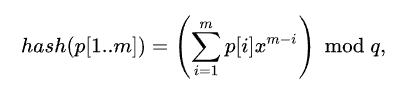

# Алгоритм Рабина-Карпа

1. Вычисляем хэш
2. Циклом сравниваем хэш, и, если совпадает, проверяем посимвольно во избежание _коллизии_.

## Как считается хэш
Берем строку
```
abcde
```
Номер каждого символа в алфавите умножаем на коэффицент позиции, т.е **e*1**, **d*2** и т.д.
Суммируем все это дело и получаем значение хэша. Для таблицы ASCII размер алфавита - 256. короче ты понял ты же не тупой


Вот эта страшная хрень на самом деле означает создать многочлен типа a^3+b^2+c, то есть короче многочлен и поделить его зачем-то на Q

### Пример
Найти фрагмент
```
abcd
```
В строке типа
```
bcabcdabcccbdabc
```
