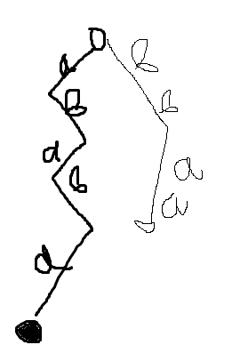

# Суффиксное дерево

## Бор

Бор (bohr) - структура для хранения строк, дерево с символами на ребрах.
Проще говоря, дерево для строк.

Возьмем слова:
`ababa`
`bbaa`
`baaba`
`abba`
`aa`

Строим граф для **ababa** и **bbaa**

В этом дереве:
Ребра - элементы строк (_буквы_) и переход от одного состояния к другому
Вершины

Вот еще красивая картинка для бора

