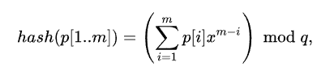

# Алгоритм Рабина-Карпа

1. Вычисляем хэш
2. Циклом сравниваем хэш, и, если совпадает, проверяем посимвольно во избежание _коллизии_.

## Как считается хэш
Берем строку
```
abcde
```
Номер каждого символа в алфавите умножаем на коэффицент позиции, т.е **e*1**, **d*2** и т.д.
Суммируем все это дело и получаем значение хэша. Для таблицы ASCII размер алфавита - 256. короче ты понял ты же не тупой



Вот эта страшная хрень на самом деле означает создать многочлен типа a^3+b^2+c, то есть короче многочлен и зачем-то взять от него остаток от деления на Q
Вроде как Рабин и Карп таким образом уменьшают вероятность коллизии

# Префиксная функция №2

Есть строка
```
abbababbababba
```
Идем слева направо. Первый символ А. 2 и 3 символ - б, для них записываем значение 0.
Тогда у нас пока есть данные _[0, 0, 0..._.

Далее у нас идет а, затем б, далее данные опять не совпадают с префиксом.
То есть

```
[ab]b[ab]abbababba
 00 0 20 .........
```
Квадатными выделены совпадения. На этом этапе у нас префикс - аб и совпала с ним строка длины 2, как и сам префикс, значит пишем в начале совпавшего фрагмента 2.
Как же меня достала эта херь ща на питоне напишу и мб пойму

